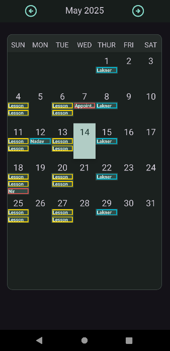
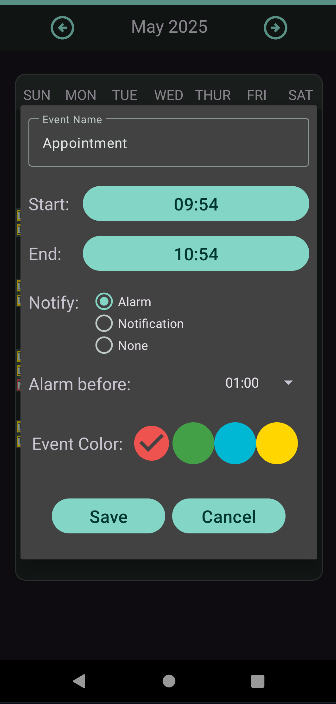
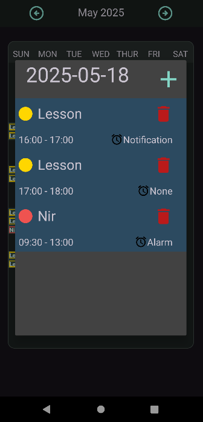

<h1> DayTastic </h1>
DayTastic is an Android calendar application that integrates weather forecasts and features an alarm system.

<h2>Screenshots</h2>

  
  
  

<h2>Technologies</h2>
<ul>
  <li>Kotlin: Primary language for Android development.</li>
  <li>Groovy: Utilized for Gradle build scripts and dependencies.</li>
  <li>APIs: Integration with external weather APIs for real-time data.</li>
  <li>Android Studio: Development environment.</li>
  <li>SQL: Database, specifically SQLite</li>
</ul>

<h2>Future Updates</h2>
<li>Redesigning the "day events list" interface.</li>
<li>Changing to weather API to one that supports more days. </li>
<li>Adding more options in the "add event" interface such as, "all day" and repeat for every day/week/month/year.</li>
